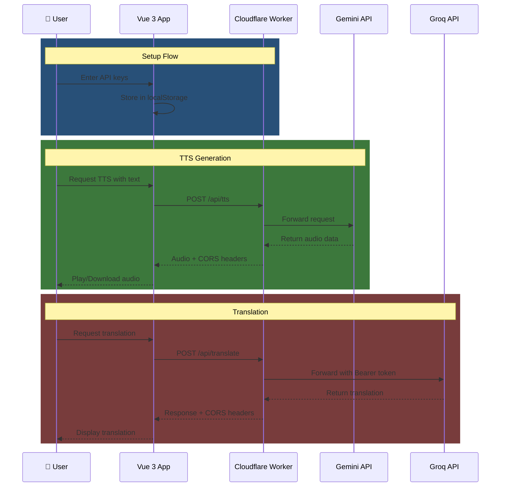

# 🔊 AmkyawDev TTS App

<div align="center">


**A modern Text-to-Speech & Translation application powered by Vue 3, TypeScript, and Cloudflare.**

[View Live Demo](https://app.tts-v1.pages.dev) • [Report Bug](https://github.com/amkyawdev/app.tts-v1/issues) • [Request Feature](https://github.com/amkyawdev/app.tts-v1/issues)

</div>

---

## 🚀 Features

| Feature | Description |
|---------|-------------|
| 🎙️ **TTS Generator** | Convert text to natural speech using Google's Gemini API |
| 🌐 **Translator** | Translate text across 15+ languages with Groq AI |
| 🔑 **Secure API Keys** | Store your keys securely in browser localStorage |
| 📱 **Responsive Design** | Beautiful UI that works on all devices |
| ⚡ **Fast Performance** | Optimized for speed with Vite bundler |

---

## 🏗️ Tech Stack

<div align="center">

| Category | Technology |
|----------|------------|
| **Frontend** | Vue 3 (Composition API) + TypeScript |
| **Build Tool** | Vite 5 |
| **State Management** | Pinia |
| **Routing** | Vue Router 4 |
| **Styling** | Panda CSS |
| **Backend Proxy** | Cloudflare Workers |
| **Hosting** | Cloudflare Pages |

</div>

---

## 📁 Project Structure

```
amkyawdev-tts-app/
├── .github/
│   └── workflows/
│       └── deploy.yml              # CI/CD for Cloudflare Pages
│
├── functions/                      # Cloudflare Pages Functions
│   └── [[path]].js                 # Fallback worker for Pages
│
├── src/
│   ├── assets/
│   │   └── main.css                # Global styles
│   │
│   ├── components/                 # Reusable UI components
│   │   ├── Navbar.vue              # Navigation with animated hamburger
│   │   └── ApiKeyInput.vue         # API key input with visibility toggle
│   │
│   ├── views/                      # Application pages
│   │   ├── GetStarted.vue          # Landing page with feature cards
│   │   ├── TtsGenerator.vue        # Text-to-Speech generator
│   │   ├── Translator.vue          # AI-powered translator
│   │   ├── UserApi.vue             # API key management
│   │   └── About.vue               # Project information
│   │
│   ├── router/
│   │   └── index.ts                # Vue Router configuration
│   │
│   ├── store/
│   │   └── apiStore.ts             # Pinia store for API keys
│   │
│   ├── App.vue                     # Root component
│   └── main.ts                     # Application entry point
│
├── worker.js                       # Cloudflare Worker for API proxy
├── wrangler.toml                  # Wrangler configuration
├── vite.config.ts                 # Vite build configuration
├── tsconfig.json                  # TypeScript configuration
├── index.html                     # HTML entry point
├── package.json                   # Dependencies & scripts
└── README.md                      # This file
```

---

## 🔄 API Flow



---

## 🛡️ Security Architecture

| Layer | Protection |
|-------|------------|
| 🔒 **Local Storage** | API keys never leave the browser |
| 🌍 **Worker Proxy** | All API calls through Cloudflare Worker |
| ✅ **CORS Headers** | Proper cross-origin configuration |
| 👁️ **Key Visibility** | Toggle to show/hide sensitive keys |

---

## 🚀 Quick Start

### Prerequisites

- Node.js 18+ 
- npm or yarn
- Gemini API key from [Google AI Studio](https://aistudio.google.com/app/apikey)
- Groq API key from [Groq Console](https://console.groq.com/keys)

### Installation

```bash
# Clone the repository
git clone https://github.com/amkyawdev/app.tts-v1.git
cd app.tts-v1

# Install dependencies
npm install

# Start development server
npm run dev

# Build for production
npm run build
```

### Development Commands

| Command | Description |
|---------|-------------|
| `npm run dev` | Start Vite dev server |
| `npm run build` | Build for production |
| `npm run preview` | Preview production build |
| `npm run type-check` | Run TypeScript type checking |

---

## ☁️ Cloudflare Deployment

### Build Settings

| Setting | Value |
|---------|-------|
| Framework | Vite |
| Build Command | `npm run build` |
| Output Directory | `dist` |

### Environment Variables (Optional)

Add fallback API keys in Cloudflare Pages dashboard:

```
GEMINI_API_KEY = your-gemini-key
GROQ_API_KEY = your-groq-key
```

### Manual Deployment

```bash
# Install Wrangler
npm install -g wrangler

# Deploy worker
wrangler deploy worker.js

# Deploy to Pages
wrangler pages deploy dist
```

---

## 📡 API Reference

### POST `/api/tts`

Generate text-to-speech audio.

**Headers:**
```
X-Gemini-Key: your-api-key
```

**Request Body:**
```json
{
  "text": "Hello, this is a test message"
}
```

**Response:** Audio file (MP3/WAV)

---

### POST `/api/translate`

Translate text to target language.

**Headers:**
```
X-Groq-Key: your-api-key
```

**Request Body:**
```json
{
  "text": "Hello world",
  "targetLanguage": "Spanish"
}
```

**Response:**
```json
{
  "choices": [{
    "message": {
      "content": "Hola mundo"
    }
  }]
}
```

---

## 📱 Route Map

| Path | Page | Description |
|------|------|-------------|
| `/` | Redirects to `/get-started` | Entry point |
| `/get-started` | Get Started | Onboarding & feature overview |
| `/tts-generator` | TTS Generator | Text-to-speech conversion |
| `/translator` | Translator | AI-powered translation |
| `/user-api` | User API | API key configuration |
| `/about` | About | Project information & tech stack |

---

## 🤝 Contributing

1. Fork the repository
2. Create your feature branch (`git checkout -b feature/amazing-feature`)
3. Commit your changes (`git commit -m 'Add amazing feature'`)
4. Push to the branch (`git push origin feature/amazing-feature`)
5. Open a Pull Request

---

## 📄 License

This project is licensed under the **MIT License** - see the [LICENSE](LICENSE) file for details.

---

<div align="center">

**Built with ❤️ using Vue 3 + TypeScript + Cloudflare**

⭐ Star this repo if you find it helpful!

</div>
