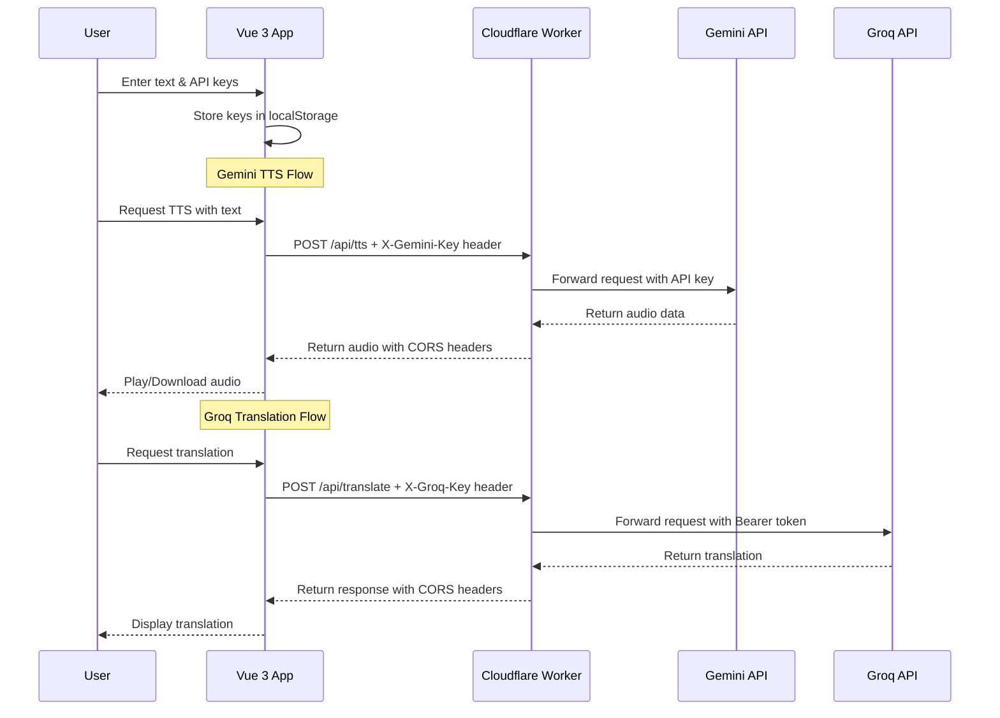

# AmkyawDev TTS App

A sleek Vue 3 + TypeScript application utilizing Gemini API for Text-to-Speech (TTS) and Groq API for lightning-fast translations. Hosted seamlessly on Cloudflare Pages.

## Features

- **/Get Started**: Introduction and onboarding
- **/TTS Generator**: Convert text into high-quality audio using Gemini
- **/Translator**: Translate text across languages using Groq
- **/User API**: Securely save your own Gemini & Groq API keys locally (stored safely in `localStorage`)

## Tech Stack

- **Frontend**: Vue 3 (Composition API), TypeScript, Vite, Vue Router, Pinia
- **Backend Proxy**: Cloudflare Workers
- **Styling**: Panda CSS
- **Hosting**: Cloudflare Pages

## Project Structure

```
amkyawdev-tts-app/
├── .github/
│   └── workflows/
│       └── deploy.yml          # CI/CD for Cloudflare Pages
├── functions/                  # Cloudflare Pages Plugins
├── public/
├── src/
│   ├── assets/                 # Global styles
│   ├── components/             # Reusable UI components
│   │   ├── ApiKeyInput.vue     # API key input component
│   │   └── Navbar.vue         # Navigation bar with hamburger menu
│   ├── views/                  # Application pages
│   │   ├── GetStarted.vue     # Landing page
│   │   ├── TtsGenerator.vue   # Text-to-Speech
│   │   ├── Translator.vue     # Translation
│   │   ├── UserApi.vue        # API key management
│   │   └── About.vue          # About page
│   ├── router/                # Vue Router configuration
│   ├── store/                 # Pinia state management
│   ├── App.vue
│   └── main.ts
├── worker.js                  # Cloudflare Worker for API proxy
├── wrangler.toml             # Wrangler configuration
├── index.html
├── package.json
├── tsconfig.json
├── vite.config.ts
└── README.md
```

## Local Development

1. **Install dependencies**:
   ```bash
   npm install
   ```

2. **Run Vite dev server**:
   ```bash
   npm run dev
   ```

3. **Test Cloudflare Worker locally**:
   ```bash
   npx wrangler dev worker.js
   ```

4. **Build for production**:
   ```bash
   npm run build
   ```

## Cloudflare Pages Setup

### Build Settings

- **Framework preset**: Vite
- **Build command**: `npm run build`
- **Output directory**: `dist`

### Environment Variables

Optionally, you can set fallback API keys in Cloudflare Pages settings:

1. Go to **Settings > Environment variables**
2. Add `GEMINI_API_KEY` and `GROQ_API_KEY` with your keys

This allows users to use default keys if they haven't configured their own.

## API Keys

Your API keys are stored securely in your browser's `localStorage` and are only sent directly to the respective API providers (Google Gemini or Groq). They are never sent to any intermediate server.

### AmkyawDev API Flow



### Security Features

| Feature | Description |
|---------|-------------|
| Lock | API keys never leave the browser |
| Shield | All API calls go through Cloudflare Worker |
| Check | Proper CORS headers for cross-origin requests |
| Key | Show/hide API keys in input fields |

## Deployment

### Automatic (GitHub Actions)

Push to `main` branch to automatically deploy via GitHub Actions. Requires `CLOUDFLARE_API_TOKEN` secret.

### Manual

1. Build the project: `npm run build`
2. Deploy to Cloudflare Pages via dashboard or `wrangler pages deploy dist`

## License

MIT
